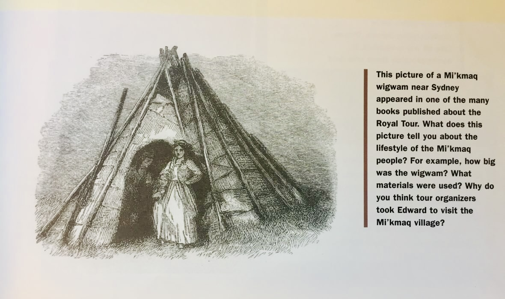

<html>
<head>

</head>
<body>

This is a sample page for the primary source material analysis. Several types of quantitative and qualitative analysis will be employed for this project including content analysis, such as coding, discourse analysis, and interpretive analysis. The standard historical document analysis framework of identifying the purpose, message, and audience. The document study will include publishing and other key identification details, images or image gallery, and a textual analysis of the material.

Visitors will reach these pages by using an HTML form with select elements, as seen below:

<form action="/action_page.php">
  <label for="cars">In which district did you attend school?</label>
  <select name="cars" id="cars">
  <option value="Halton">Halton</option>  
    <option value="Kawartha Pine Ridge">Kawartha Pine Ridge</option>
    <option value="Simcoe County">Simcoe County</option>
    <option value="York Region">York Region</option>
    <option value="Toronto">Toronto</option>
  </select>
    
  <label for=dates">In what year(s) did you attend school here?</label>
  <select name="dates" id="dates">
  <option value="1950's">1950's</option>  
    <option value="1960's">1960's</option>
    <option value="1970's">1970's</option>
    <option value="1980's">1980's</option>
    <option value="1990's">1990's</option>
  </select>
    
  <input type="submit" value="Submit">
</form>
 

Alternatively, visitors may select from a virtual timeline to be taken to relevant material.
 
<iframe src='https://cdn.knightlab.com/libs/timeline3/latest/embed/index.html?source=1PvcYDRdwoR-NM7lUlYzJAWV1kcKP1GZ-1F1qHdYScL4&font=Default&lang=en&initial_zoom=2&height=650' width='100%' height='650' webkitallowfullscreen mozallowfullscreen allowfullscreen frameborder='0'></iframe>

---
<table>
<tr>
<th>Title:</th>
<td>The Canadian Stories Reader</td>
</tr>
<tr>
<th>Year:</th>
<td>1970</td>
</tr>
<tr>
<th>Genre/Subject:</th>
<td>Canadian/Social studies</td>
</tr>
<tr>
<th>Material:</th>
<td>Textbook</td>
</tr>
<tr>
<th>Grade level:</th>
<td>9-12</td>
</tr>
<tr>
<th>District:</th>
<td>York Region</td>
</tr>
<tr>
<th>Province/Territory:</th>
<td>Ontario</td>
</tr>
<tr>
<th>Publisher:</th>
<td>Peter Martin</td>
</tr>
</table>

---
### Preface
This image from a secondary school Canadian Studies textbook depicts a Mi'kmaq wigwam and visitors during the Royal Tour. 

 
### Discussion
The diction and description of the Mi'kmaq uses the past tense, which aligns with an extinctionist or anthropological perspective. Both the references to the Mi'kmaq wigwam and Mi'kmaq people present them as artifacts. This has the effect of placing the person, the Indigenous people, in the past. They are not living beings, but museum articfacts to be studied. They no longer exist. They do not require attention.
The illustration depicts a Royal Tour visitor 'posing' in front of the wigmam as you would at a common tourist attraction or museum exhibit. It removes all trace of living culture from the narrative.

Both the illustration and the narrative place the Indigenous people in the past, relegating them to mere historical exhibits and tourist amusements. 