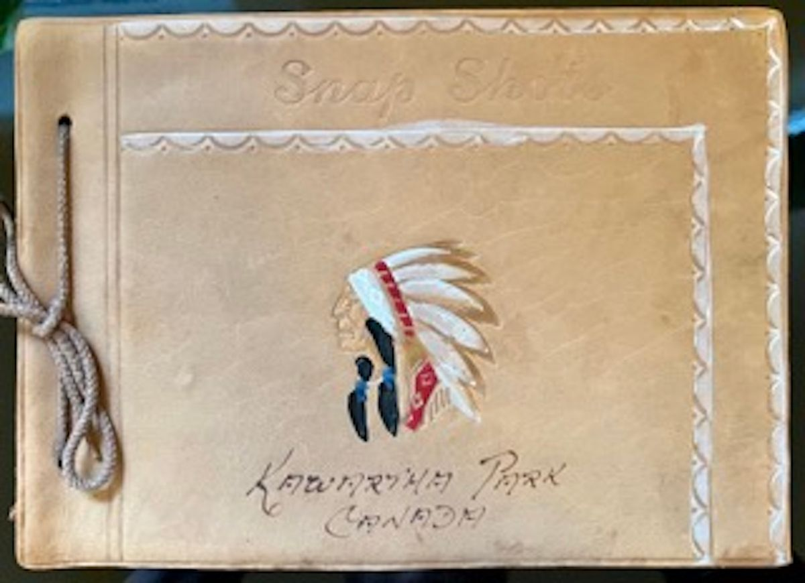

## Background 

This project was conceived in 2021 and my participation in Hacking History (HIS496H1) gave me the opportunity to treat this idea as a serious study in Digital Humanities. Hacking History has equipped me with the foundational knowledge in technology and data to begin to think, plan, and develop projects for Digital Humanities. The project is in an exploratory development phase. 

## Inspiration

For many Canadians, the concept of reconciliation is a matter of government policy. Fortunately, the movement towards reconciliation recieves ample news coverage and we can now see businesses, institutiions, and communities introduce ways to include Indigenous lives and voices into their work, missions, and cultures. These are important and necessary moves, but I wonder what the 'average' Canadian can do, on a human level, to connect with their own past and make connections with Indigenous commmunities.   

<figure>

<figcaption align = "left">The Friendship Belt, or The Covenant Chain belt, represents one of the earliest treaties between the Crown and First Nations peoples and established the foundation for First Nations - Crown relationships for generations thereafter. The belt shows that the Crown is linked by a chain to the First Nations peoples of this land. The three links of the chain represent a covenant of friendship, good minds, and the peace which shall always remain between us. The Covenant Chain is made of silver symbolizing that the relationship will be polished from time to time to keep it from tarnishing. This was the basis of the Nation to Nation relationship between the British Crown and the First Nations who became their allies in the formation of early Canada. <a href="https://vitacollections.ca/sixnationsarchive/details.asp?ID=2687120">Image attribution.</a></figcaption></figure>

## Statement of Purpose

As my mother and I began the painful process of sorting through my recently-deceased grandmother’s things, among the many silk scarves and countless photographs, we came across an photo album of black and white photographs of my grandmother’s summers in the Kawarthas, a favourite haunt of my family. The album, a leather-bound with a colourful illustration of an Indigenous person in headdress adorns the cover, inside were many photographs of typical Canadian summer activities like canoeing, swimming, and relaxing.

Apart from the familial sentimentality, genealogical value, and vintage Canadiana this photo album provides, it also prompted me to think about the connection between the illustration on the cover and the contents.

With Canada now joining the exclusive club of countries who have committed genocide I wondered what is my responsibility as the ancestor of settlers and pioneers.

As I think of my grandparents and others, who didn’t know or didn’t ask or didn’t care to know, I think the greatest crime I can commit not following them by not asking or doing.

As I began to reflect on news and findings, I wondered what the responsibility of citizens, of Canadian people, do we have. My thoughts turned to the idea of responsibility as a vital component. But how do we think about responsibility. How do we envision responsibility through the education system when information, narratives, histories, are denied to us. This is how I arrived at the idea for this project.

<figure>

<figcaption align = "left">Kawartha Park photo album, circa 1943. I discovered this family photo album while I was helping my mother sort out my grandmother's posessions. The photographs inside depict my grandparents and their friends enjoying canoeing, swimming, and other summer activities at the cottage.</figcaption></figure>

## Project Status

<h4>Literature review and primary source research</h4>

A cursory literature review has been conducted covering topics including curriculum history, ethics, reconciliation, political injustice, cultural anthropology, rhetorica, and democratic theory and governance. Primary source materials have been located through the help of the librarian staff at the Ontario Institute for Education's Ontario Historical Education Collection and include the Ontario Historical Textbook Collection and the Ontario Government Education Documents and Curricula. 

<h4>Technology</h4>

This project utilizes version control software GitHub, coding software Visual Studio Code, and content management platform Eleventy. Depending on future database requirements, content may have to be migrated to a new platform. The current setup is sufficient to present a preview of the project.

<h4>Faculty Support</h4>

Developing relationships with faculty members and subject matter experts is crtical to the projects short- and long-term goals. I have connected with Professor Heidi Bohaker of the University of Toronto and Pia Russell of Victoria University, both scholars of Canadian history and Indigenous studies.

<h4>Events</h4>

Although this project is in its infancy, I have submitted descriptive abstracts to the Centre for Ethics Undergraduate Conference and the Critical Digital Humanities International Conference for consideration.
